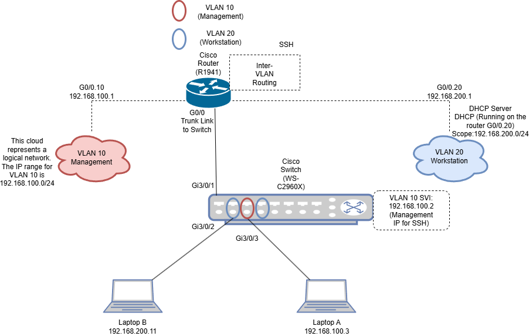
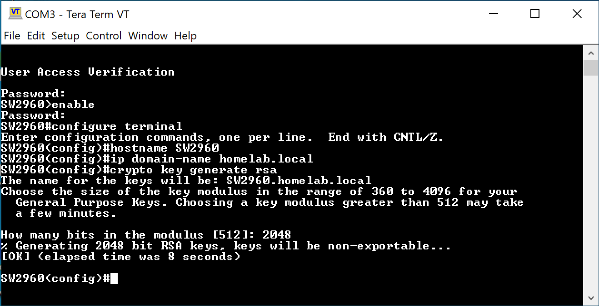

# 🖥️ End-to-End-Network-Simulation
<h2>📜 Description </h2>
A fully documented simulation of an enterprise-style network built with real Cisco hardware. This project includes VLAN segmentation, inter-VLAN routing (Router-on-a-Stick), DHCP, SSH configuration, static IP and subnet assignment, troubleshooting, and network testing. The goal was to simulate a secure, isolated environment using Cisco IOS CLI and demonstrate fundamental networking and security skills.
<h2> 🧰 Devices Used </h2>
<b> Router: </b> Cisco 1941-SEC/K9 2 Port Gigabit Router
 
<b> Switch: </b> Cisco WS-C2960X-24PS-L-24-POE Port Catalyst 24-Port Switch
 
<b>Client Devices: </b> 2 Surface Laptops, one with Windows 10 and another with Windows 11
 
<b> Ethernet Cables: </b> Stripped, cut, and crimped myself two straight through cables using Cat6E 23AWG UTP solid copper wire for POE capability
<h2>🚀 Software </h2>
<b>Terminal Software: </b> PuTTY / Tera Term 
 
<b>Diagram Tool: </b> draw.io (for network diagrams)
 
<b>Documentation: </b> Notion 
 
<b>Testing Tools: </b> ping, tracert, ipconfig, ssh
<h2> 🧱 Network Topology </h2>

<h2> 💡Phase 1: Device Setup & Isolation (Systems Build + Configuration) </h2>
<b> Goal: </b> To simulate a segmented, isolated network environment with proper device configuration and VLAN routing, using real Cisco IOS CLI commands.
 
 
Configuration Steps:
 
 
<b> 1. Baseline Configuration for the Switch: </b>
 
The switch I purchased came with no firmware installed so it booted up in ROMMON mode. I then tried to use a flash drive to install firmware on to it but the flash drives I had on hand were not compatible with the switch. So I ended up using a console cable and Tera Term to transfer the firmware and install it. Once it was installed, ROMMON mode was turned off and ports now allowed for POE and data transfer. Once I was finally able to console in and reach the proper switch prompt (User EXEC Mode) in the CLI using Tera Term I ran:
 
 
<li> enable #to enter privileged EXEC mode </li> 
<li> configure terminal #to access global configuration mode </li>
<li> hostname SW2960 </li>
<li> enable secret ******** </li>
 
<b> #The following for securing Console Access </b>
 
<li> line console 0 </li>
<li> password ******** </li>
<li> login </li>
<li> exit </li>
 
<b> # Virtual Teletype Access Secured (Used for inital testing for basic remote login, I set up SSH later): </b>
<li> line vty 0 4 </li>
<li> password ******** </li>
<li> login </li>
<li> exit </li>
<li> copy running-config startup-config </li>
 
<b> 2. Baseline Configuration for the Router </b>
 
 
When I originally booted my router I had connected it to my ISP's router and set up a config to get things going beteen the Cisco router and my ISP's router. I then disconnected the Cisco router and decided to create this isolated network simulation project. But what ended up happening was when I began to set up the isolated environment and booted my Cisco router again, the config I had set earlier was not configured for this isolated environment and so it did not boot properly and got stuck on a certain command in the console while it was booting. I did not realize at first why it was not finishing the boot process until I did some research and realized it was due to the startup-config I had configured prior. 
To bypass the faulty configuration, I entered ROMMON mode by rebooting the router and pressing Ctrl + Pause/Break during boot (I used the on-screen keyboard since my laptop lacks a physical Pause key).
Once in ROMMON, I ran:
 
 
<li> confreg 0x2142 </li>
<li> reset </li>
 
This told the router to ignore the startup-config in NVRAM on the next boot. The router successfully loaded into user EXEC mode without applying the problematic config.
After gaining access, I restored the configuration register to its default value (0x2102), which tells the router to load the IOS from flash and apply the new saved startup-config during future boots:
 
 
<li> enable </li>
<li> configure terminal </li>
<li> config-register 0x2102 </li> #the register was originally set to 0x2142 
<li> write memory </li>
<li> reload </li>
 
Here are the config details that I entered in the CLI to setup the router:
 
 
<li> enable </li>
<li> hostname R1941 </li>

# Secures access to privileged EXEC mode (Router#)
<li> enable secret ******** </li>
 
# The following Secures Console Access
<li> line console 0 </li>
<li> password ******** </li>
<li> login </li>
<li> exit </li>
# Secure VTY Access for Inital Testing
<li> line vty 0 4</li>
<li> password ******** </li>
<li> login </li>
<li> exit </li>

#Always save
<li> copy running-config startup-config </li>
 
<b> 3. Interface Configuration for Router </b>
 
 
CLI Snippet:
 
 
<li> enable </li>
<li> configure terminal </li>
<li> interface GigabitEthernet0/0</li>
<li> ip address 192.168.100.1 255.255.255.248</li>
<li> no shutdown </li>
<li> interface GigabitEthernet0/1 </li>
<li> ip address 192.168.200.1 255.255.255.0 </li>
<li> no shutdown </li>
<li> exit </li>
 
<b> 4. VLAN Setup </b>
 
 
Consoled into the switch and ran:
 
<li> vlan 10 </li>
<li> name Management </li>
<li> exit </li>
<li> vlan 20 </li>
<li> name Workstation </li>
<li> exit </li>
 
<b> 5. Default Gateway </b>
 
 
in the swithces console I ran:
 
<li> ip default-gateway 192.168.100.1 </li>
 
This tells the switch which IP address to use when sending traffic to devices not on the same subnet. In this case, 192.168.100.1 is the routers IP. 
 
 
<b> 6. Port Assignments </b>
 
 
The following sets up the Management port for VLAN 10 and the ports for VLAN 20. In the switches console I ran:
 
 
<li> interface GigabitEthernet3/0/3 </li>
<li> switchport mode access </li>
<li> switchport access vlan 10 </li>
<li> exit </li>

 
<li> interface range GigabitEthernet3/0/2, GigabitEthernet3/0/4 </li>
<li> switchport mode access </li>
<li> switchport access vlan 20 </li>
<li> exit </li>

 
<b> 7. Management Interface (SVI) </b>
 
Creating a Switch Virutal Interface (SVI) for VLAN 10. This give the switch an IP so that I can remotely manage it through SSH. 
<li> interface vlan 10 </li>
<li> ip address 192.168.100.2 255.255.255.248 </li>
<li> no shutdown </li>
<li> exit </li>
 
<b> 8. Router-on-a-Stick (Inter VLAN Routing) </b>
 
#Step 1 - Configuring Subinterfaces on the Router:
<li> enable </li>
<li> configure terminal </li>
<li> interface GigabitEthernet0/0.10 </li>
<li> encapsulation dot1q 10 </li>
<li> ip address 192.168.100.1 255.255.255.248 </li>
<li> exit </li>
 
<li> interface GigabitEthernet0/0.20 </li>
<li> encapsulation dot1q 20 </li>
<li> ip address 192.168.200.1 255.255.255.0 </li>
<li> exit </li>
 
Note: I ran into an issue here after running the ip address command because the physial interfaces (G0/0 and G0/1) were still holding IP addresses and that conflicts with the subinterface setup. We can't have both a physical interface and its subinterfaces configured with IP addresses at the same time so I had to remove the IP's from the physical interface first:
 
 
<li> enable </li>
<li> configure terminal </li>
<li> interface GigabitEthernet0/0 </li>
<li> no ip address </li>
<li> exit </li>
 
Repeat these commands for 0/1. After doing this, the subinterfaces should be good to go after re running those commands that threw an error.
 
Setting up subinterfaces on a physical router port allows the router to route traffic between VLANs. After running the commands for setting up the subinterfaces, the single physical router G0/0 now logically handles multiple VLANs, each with its own subinterface, a VLAN tag and a gateway IP. This allows the router to route traffic between VLANs 10 and 20, even though they're on the same physical link (hence the name Router-on-a-Stick). 

 
#Step 2 - Configure the Switch Port as a Trunk:
 
<li> enable </li>
<li> configure terminal </li>
<li> interface GigabitEthernet3/0/1 </li>
<li> switchport mode trunk </li>
<li> exit </li>
<li> copy running-config startup-config </li>
 

 
<h2> 💡Phase 2: Network Services & Testing </h2>
 
<b> 1. Set Up DHCP on Router </b>
 
Commands ran:
 

 

 
Plugged my laptop into port 3/0/2 and it was given an ip from the pool:
 

 
From laptop B's command prompt:
 

 
Laptop A's IP details:
 

 
<b> 2. Inter- VLAN Routing Test </b>
 
Laptop B ping to Laptop A:
 

 
Laptop A ping to Laptop B:

 
One issue I ran into here while trying to test Inter VLAN routing was that Laptop A and Laptop B ping requests were timing out. What I found was that the File and Printer Sharing (Echo Request - ICMPv4-In) for the Private profile in inboud rules in Windows Firewall was set to only allow traffic from the local subnet and since inter- VLAN communication means the devices are on different subnets, the rule silently blocks the ping. So I had to change the scope for that rule in properties and select Any IP address for Remote IP address:
 

 
<b> 3. Configuring SSH on Router </b>
 
Commands ran:

 
Accessing the Router through SSH from PuTTY:
 

 
<b> 4. Configuring SSH on Switch </b>
 
Commands ran:
 

 
Additional commands that were ran but not shown in the screenshot:
<li> username admin privilege 15 secret ******** </li>
<li> line vty 0 4</li>
<li> transport input ssh </li>
<li> login local </li>
<li> exit </li>

