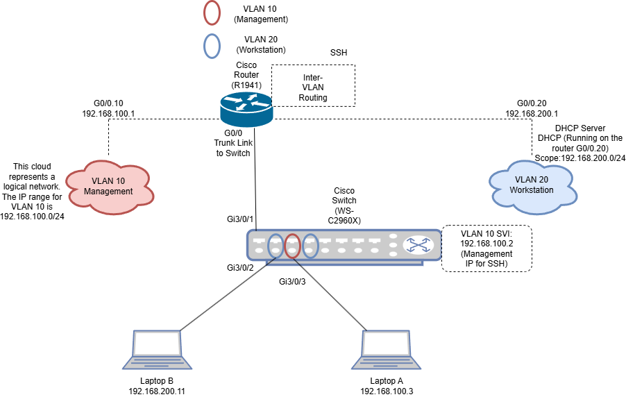

# 🖥️ End-to-End-Network-Simulation
<h2>📜 Description </h2>
A fully documented simulation of an enterprise-style network built with real Cisco hardware. This project includes VLAN segmentation, inter-VLAN routing, DHCP, SSH configuration, and network testing. The goal was to simulate a secure, isolated environment using Cisco IOS CLI and demonstrate fundamental networking and security skills.
<h2> 🧰 Devices Used </h2>
<b> Router: </b> Cisco 1941-SEC/K9 2 Port Gigabit Router
 
<b> Switch: </b> Cisco WS-C2960X-24PS-L-24-POE Port Catalyst 24-Port Switch
 
<b>Client Devices: </b> 2 Surface Laptops, one with Windows 10 and another with Windows 11
 
<b> Ethernet Cables: </b> Stripped, cut, and crimped myself two straight through cables using Cat6E 23AWG UTP solid copper wire for POE capability
<h2>🚀 Software </h2>
<b>Terminal Software: </b> PuTTY / Tera Term 
 
<b>Diagram Tool: </b> draw.io (for network diagrams)
 
<b>Documentation: </b> Notion 
 
<b>Testing Tools: </b> ping, tracert, ipconfig, ssh
<h2> 🧱 Network Topology </h2>

<h2> 💡Phase 1: Device Setup & Isolation (Systems Build + Configuration) </h2>
<b> Goal: </b> To simulate a segmented, isolated network environment with proper device configuration and VLAN routing, using real Cisco IOS CLI commands.
 
Configuration Steps:
 
<b> 1. Baseline Configuration for the Switch </b>
 
The switch I purchased came with no firmware installed so it booted up in ROMMON mode. I then tried to use a flash drive to install firmware on to it but the flash drives I had on hand were not compatible with the switch. So I ended up using a console cable and Tera Term to transfer the firmware and install it. Once it was installed, ROMMON mode was turned off and ports now allowed for POE and data transfer. Once I was finally able to console in and reach the proper switch prompt (User EXEC Mode) in the CLI using Tera Term I ran:
 
<li> enable #to enter privileged EXEC mode </li> 
<li> configure terminal #to access global configuration mode </li>
<li> hostname SW2960 </li>
<li> enable secret ******** </li>
 
<b> #The following for securing Console Access </b>
 
<li> line console 0 </li>
<li> password ******** </li>
<li> login </li>
<li> exit </li>
 
<b> # Virtual Teletype Access Secured (Used for inital testing for basic remote login, I set up SSH later): </b>
<li> line vty 0 4 </li>
<li> password ******** </li>
<li> login </li>
<li> exit </li>
<li> copy running-config startup-config </li>
<b> 2. Baseline Configuration for the Router </b>
 
On initial boot the router would get stuck on a certain command while I was consoled in through putty and it turns out it was because the router was loading the startup config that was misconfigured so to fix this I powered on the router and meanwhile I was consoled in on my laptop through putty and while the router was booting I sent Ctrl+Pause (I had to use the on screen keyboard for my surface laptop since it didn't have a pause button) this dropped me into rommon mode and I entered confreg 0x2142 which tells the router to ignore the startup-config. After I sent a reset command and was then able to get a normal boot from the router and dropped into user EXEC mode. Here are the config details that I entered in the CLI to setup the router:
 
<li> enable </li>
<li> hostname R1941 </li>

# Secures access to privileged EXEC mode (Router#)
<li> enable secret ******** </li>
 
# The following Secures Console Access
<li> line console 0 </li>
<li> password ******** </li>
<li> login </li>
<li> exit </li>
# Secure VTY Access for Inital Testing
<li> line vty 0 4</li>
<li> password ******** </li>
<li> login </li>
<li> exit </li>

#Always save
<li> copy running-config startup-config </li>

