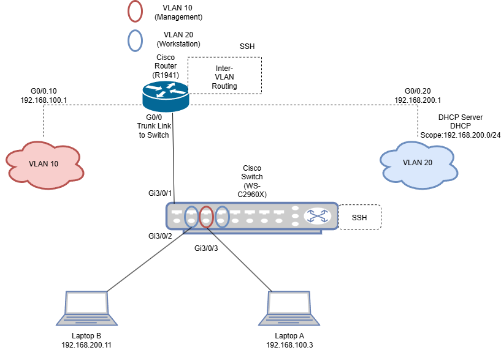

# 🖥️ End-to-End-Network-Simulation
<h2>📜 Description </h2>
A fully documented simulation of an enterprise-style network built with real Cisco hardware. This project includes VLAN segmentation, inter-VLAN routing, DHCP, SSH configuration, and network testing. The goal was to simulate a secure, isolated environment using Cisco IOS CLI and demonstrate fundamental networking and security skills.
<h2> 🧰 Devices Used </h2>
<b> Router: </b> Cisco 1941-SEC/K9 2 Port Gigabit Router
 
<b> Switch: </b> Cisco WS-C2960X-24PS-L-24-POE Port Catalyst 24-Port Switch
 
<b>Client Devices: </b> 2 Surface Laptops, one with Windows 10 and another with Windows 11
 
<b> Ethernet Cables: </b> Stripped, cut, and crimped myself two straight through cables using Cat6E 23AWG UTP solid copper wire for POE capability
<h2>🚀 Software </h2>
<b>Terminal Software: </b> PuTTY / Tera Term 
 
<b>Diagram Tool: </b> draw.io (for network diagrams)
 
<b>Documentation: </b> Notion 
 
<b>Testing Tools: </b> ping, tracert, ipconfig, ssh
<h2> 🧱 Network Topology </h2>

